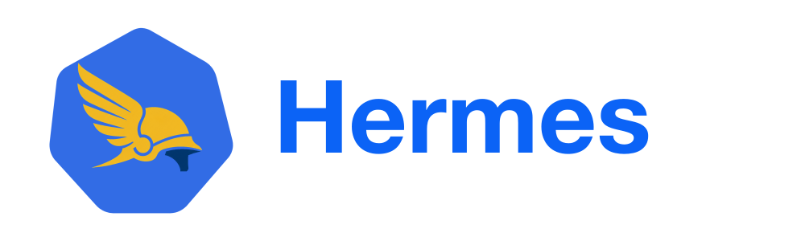
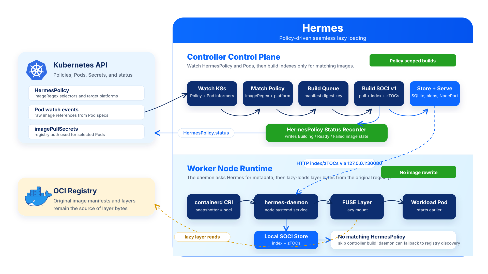

<div style="text-align: center">
  <p align="center">
    
    <br><br>
    <i>Policy-driven seamless lazy loading.</i>
  </p>
</div>

<p align="center">
  <a href="https://goreportcard.com/report/github.com/cloudpilot-ai/hermes">
    
  </a>
  <a href="./LICENSE">
    
  </a>
  <a href="https://github.com/cloudpilot-ai/hermes">
    
  </a>
  <a href="docs/reports/ec2-kind-full-suite-2026-05-27.md">
    
  </a>
</p>

Hermes is a Kubernetes-native modified fork of the AWS Labs
[SOCI Snapshotter](https://github.com/awslabs/soci-snapshotter). It keeps the
containerd snapshotter runtime for lazy image loading, then adds a
policy-driven cluster-side controller that builds, caches, and serves SOCI
artifacts for selected images already running in the cluster.

The intent is simple: application teams keep publishing normal OCI images, and
platform teams decide which images should be optimized with `HermesPolicy`.
Hermes prepares SOCI indexes outside the application build pipeline. Worker
nodes ask Hermes for the SOCI index and zTOC blobs for matching images, then
continue reading layer bytes lazily from the original registry.

## Why Hermes

SOCI improves cold-start time by avoiding a full image download before a
container starts. Upstream SOCI typically discovers indexes from a registry
using image-side artifacts: SOCI v1 via OCI referrers, or SOCI v2 via image
manifest annotations.

Hermes changes that operating model:

- A `HermesPolicy` CRD selects which observed Pod images should be optimized.
- A controller watches both `HermesPolicy` objects and Kubernetes Pods, then
  queues only images that match a policy.
- The controller builds SOCI v1 indexes in process from the original image.
- SOCI index and zTOC blobs are stored in a controller-managed artifact cache.
- The node snapshotter fetches those artifacts from Hermes before falling back
  to normal registry discovery, when configured.
- Application images remain unmodified; no `soci create` step is required in
  each application CI pipeline.
- Images that do not match a `HermesPolicy` are left alone and can still start
  normally through the daemon fallback path.

## Architecture



At a high level, Hermes splits SOCI into two responsibilities:

1. The controller side discovers policy-selected images, builds SOCI metadata,
   and exposes an artifact service for nodes.
2. The node side runs a modified SOCI snapshotter that integrates with
   containerd and consumes controller-managed artifacts during mount.

The runtime path looks like this:

1. A platform operator creates one or more `HermesPolicy` objects.
2. A Pod is created or updated in Kubernetes.
3. `hermes-controller` sees the Pod image reference through a Pod informer and
   checks it against the in-memory `HermesPolicy` store.
4. If a policy matches, the controller enqueues a build task for the policy's
   target platform or platforms.
5. The controller pulls or resolves the image through containerd, using the
   Pod's `imagePullSecrets` when present, builds a SOCI v1 index and zTOCs with
   the embedded SOCI libraries, and stores the result in SQLite plus an artifact
   blob table.
6. The controller updates `HermesPolicy.status` with `Building`, `Ready`, or
   `Failed` image state.
7. On the worker node, containerd calls `hermes-daemon` as the `soci`
   snapshotter proxy plugin.
8. The daemon asks the Hermes controller for a ready SOCI index using the image
   manifest digest and platform.
9. The daemon stores the returned index and zTOCs in its local SOCI content
   store, mounts the layer with FUSE, and lazy-loads layer spans from the
   original registry.

## Benchmark

The current EC2 + kind benchmark uses the large public ECR vLLM image
`763104351884.dkr.ecr.us-east-1.amazonaws.com/vllm:0.9-gpu-py312-ec2` on
`linux/amd64`. The image is about `10.8 GB` compressed.

| Image | Normal overlayfs | Hermes lazy loading | Speedup |
| --- | ---: | ---: | ---: |
| vLLM, `10.8 GB` | `5 min 34 s` | `15 s` | `22.2x` |

The Hermes number measures Pod startup after the SOCI artifact is ready. See
the [full EC2 + kind report](docs/reports/ec2-kind-full-suite-2026-05-27.md)
for details.

## Components

- `HermesPolicy`: Cluster-scoped CRD that selects Pod image references with
  regular expressions and optionally lists target platforms.
- `hermes-controller`: Watches `HermesPolicy` objects and Pods, builds SOCI v1
  artifacts for matching images, stores build state, records policy status, and
  serves artifacts to nodes.
- `hermes-daemon`: Runs on Kubernetes worker nodes as a containerd snapshotter
  proxy plugin.
- Artifact service: Lets nodes fetch controller-managed SOCI metadata.
- Local SOCI store: Keeps fetched indexes and zTOCs on the node so the existing
  lazy mount path can operate normally.

Ready artifacts are reused for later Pods using the same image manifest digest
and platform.

## Configuration

Install the CRD before running the controller:

```bash
kubectl apply -f deploy/hermespolicy-crd.yaml
```

Create a `HermesPolicy` to decide which Pod images should get SOCI artifacts:

```yaml
apiVersion: hermes.cloudpilot.ai/v1alpha1
kind: HermesPolicy
metadata:
  name: prod-large-images
spec:
  paused: false
  imageSelectors:
    - imageRegex: ".*vllm.*"
  platforms:
    - linux/amd64
```

`imageSelectors` are ORed together and currently support `imageRegex` against
the raw image reference from Pod specs. If `platforms` is empty, the controller
uses its default `--platform` value. Setting `paused: true` stops new automatic
enqueueing for the policy without deleting status.

For private registries, keep using normal Kubernetes `imagePullSecrets` on the
matching Pods. The controller reads those Secrets and uses them when pulling the
image for index construction.

The controller writes build progress back to `HermesPolicy.status`:

```bash
kubectl get hermespolicy
kubectl get hermespolicy prod-large-images -o yaml
```

The node-side daemon enables controller-managed artifacts with
`external_artifact_store`:

```toml
[pull_modes]
  [pull_modes.soci_v1]
    enable = true

[external_artifact_store]
  enable = true
  endpoint = "http://127.0.0.1:30080"
  timeout_sec = 5
  platform = "linux/amd64"
  fallback_to_registry = true
```

Hermes exposes the controller with a Kubernetes `NodePort` Service. The sample
manifest uses `nodePort: 30080`, which is inside the default Kubernetes and EKS
NodePort range. The node-side daemon runs as a host systemd service and talks
to the controller through `127.0.0.1:30080`, avoiding Kubernetes Service DNS for
the host process. When `fallback_to_registry = true`, images without a ready
Hermes artifact can still fall back to normal registry discovery and startup.

See [examples/daemon/config.toml](examples/daemon/config.toml) for the minimal
daemon config.

The sample Kubernetes deployment for the controller is in
[deploy/hermes-controller.yaml](deploy/hermes-controller.yaml), and a sample
policy is in [examples/kubernetes/hermespolicy.yaml](examples/kubernetes/hermespolicy.yaml).
The controller deployment uses a PVC for the controller cache and mounts the
host containerd socket so the controller can pull images and build SOCI
artifacts. The Service is intentionally `NodePort` so the daemon can use the
same node-local endpoint on EKS and kind.

## Contributing

Issues and pull requests should include the image, platform, containerd version,
Kubernetes environment, matching `HermesPolicy`, and whether the artifact came
from Hermes or registry discovery. See [CONTRIBUTING.md](CONTRIBUTING.md) for
the contribution guide.

## License

Hermes is licensed under Apache License 2.0. See [LICENSE](LICENSE) and
[NOTICE.md](NOTICE.md).
